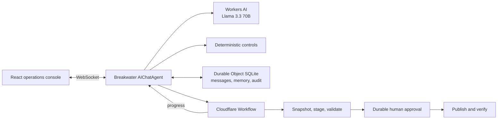

# Breakwater

**Evidence-first AI change control for lakehouse pipelines, built entirely on Cloudflare.**

Breakwater reviews proposed analytical-data changes against schema contracts, lineage, profile controls, and governance policy. It explains risks with evidence, learns explicit organization rules, and coordinates a durable, human-approved rollout.

> This repository is an optional assignment for Cloudflare's Principal Software Engineer, Data role. It is a focused control-plane prototype, not a generic data chatbot.

## Try It In 60 Seconds

1. Open **Billing v42** and select **Run controls**.
2. Inspect the contract, PII, lineage, and reconciliation evidence.
3. Ask the agent, `Review this change. Is it safe to ship?`
4. Select **Start safe rollout**. The Workflow stages remediations and reruns controls.
5. Refresh while publication is paused. The review and approval gate remain.
6. Approve with a reason and watch the Workflow publish and verify.
7. Tell the agent, `Remember that *_token fields are secret and must never enter analytical exports.`
8. Approve the memory write, switch to **Support export**, and rerun controls.

## Why This Problem

Lakehouse changes often pass code review while silently changing grain, breaking downstream contracts, or widening access to sensitive data. Lineage, profile results, policy, and deployment state usually live in separate tools. Breakwater makes those controls one auditable decision flow.

It complements a natural-language data agent such as Cloudflare's Skipper rather than duplicating it: Skipper helps users ask data questions; Breakwater helps platform engineers change the data safely.

## Architecture



| Assignment component    | Breakwater implementation                                                                                     |
| ----------------------- | ------------------------------------------------------------------------------------------------------------- |
| LLM                     | `@cf/meta/llama-3.3-70b-instruct-fp8-fast` on Workers AI                                                      |
| Workflow / coordination | `AgentWorkflow` with durable steps, retries, progress, and a seven-day approval gate                          |
| User input              | Streaming chat and structured review controls over Agents SDK WebSockets                                      |
| Memory / state          | Per-session Durable Object SQLite for chat, typed policy memory, reviews, Workflow tracking, and audit events |

See [`docs/architecture.md`](docs/architecture.md) for trust boundaries, state transitions, and the production mapping.

## Evidence, Not Chain Of Thought

The model does not create authoritative findings or mutate publication state.

1. Deterministic controls generate evidence and findings.
2. Every finding must cite one or more known evidence IDs.
3. The LLM inspects, prioritizes, and explains those results.
4. Policy memory requires explicit tool approval.
5. Publication requires a separate durable Workflow approval.
6. The UI shows tool activity and evidence, never private reasoning traces.

The three model tools have one responsibility each:

- `inspectCatalog`: current/proposed schemas, lineage, profile checks, and stored policy
- `evaluateChange`: authoritative contract, governance, quality, and transitive-lineage controls
- `rememberPolicy`: approval-gated typed organization memory

## Hero Scenario

`billing-v42` proposes a realistic billing-model change that:

- Removes contracted `account_id` and `revenue_usd` columns
- Changes the declared model grain
- Adds `contact_email` to a broadly accessible mart
- Joins effective-dated prices using only `plan_id`
- Produces a 23.7% revenue reconciliation delta
- Impacts a finance rollup, executive dashboard, and support export

The safe rollout preserves compatibility aliases, isolates sensitive data, repairs the temporal join, stages a candidate, reruns controls, and pauses before publication.

## Development

Prerequisites:

- Node.js 22 or newer
- A Cloudflare account
- Wrangler authentication via `npx wrangler login` or a scoped `CLOUDFLARE_API_TOKEN`

All packages install locally in the repository:

```bash
npm ci
npm run dev
```

Workers AI has no local simulator, so development uses Cloudflare's remote binding. No OpenAI or Anthropic key is required.

Useful commands:

```bash
npm test             # deterministic golden set
npm run check        # formatting, lint, types, and tests
npm run deploy -- --dry-run
npm run deploy
```

## Evaluation

The deterministic suite currently contains 12 passing tests. The golden set covers:

- Safe additive changes
- Contract removal
- Physical type changes
- PII on broad and restricted assets
- Failed aggregate reconciliation
- Transitive downstream lineage
- Learned wildcard policy
- Invalid or hallucinated evidence references

Full methodology and current gaps are in [`docs/evaluation.md`](docs/evaluation.md).

## Repository Layout

```text
src/
  agent.ts                     AIChatAgent, tools, SQLite state, audit callbacks
  rollout-workflow.ts          durable remediation and approval workflow
  app.tsx                      real-time operations console
  domain/
    fixtures.ts                synthetic billing and support catalog
    review-engine.ts           deterministic evidence and policy controls
    evaluation.test.ts         golden change evaluation set
docs/
  architecture.md
  evaluation.md
  prompt-history/
```

## Scope And Limitations

- The catalog and profiles are synthetic fixtures modeled after dbt/DataHub metadata.
- Publication updates a simulated control-plane version. It does not execute arbitrary SQL or mutate a real warehouse.
- The demo has per-browser session isolation but no enterprise identity or role model.
- LLM prose is not itself an authorization or policy decision.
- R2 Data Catalog and R2 SQL are production adapters, not dependencies of the assignment demo.

These boundaries are intentional. They keep the live demo safe and deterministic while showing where production systems integrate.

## Production Evolution

| Prototype                  | Production adapter                           |
| -------------------------- | -------------------------------------------- |
| Synthetic catalog fixture  | DataHub or OpenLineage API                   |
| Seeded profile checks      | Trino/R2 SQL candidate queries               |
| Simulated namespace        | Iceberg branch or isolated catalog namespace |
| Browser session identity   | Cloudflare Access identity and groups        |
| Agent SQLite policy memory | Governed organization policy service         |
| Simulated publication      | Transformer/dbt deployment API               |

## AI Assistance

AI-assisted development was used throughout, as encouraged by the assignment. User-authored prompts and outcome notes are preserved in [`docs/prompt-history`](docs/prompt-history/README.md). No secrets or hidden chain-of-thought are included.

## License

MIT
